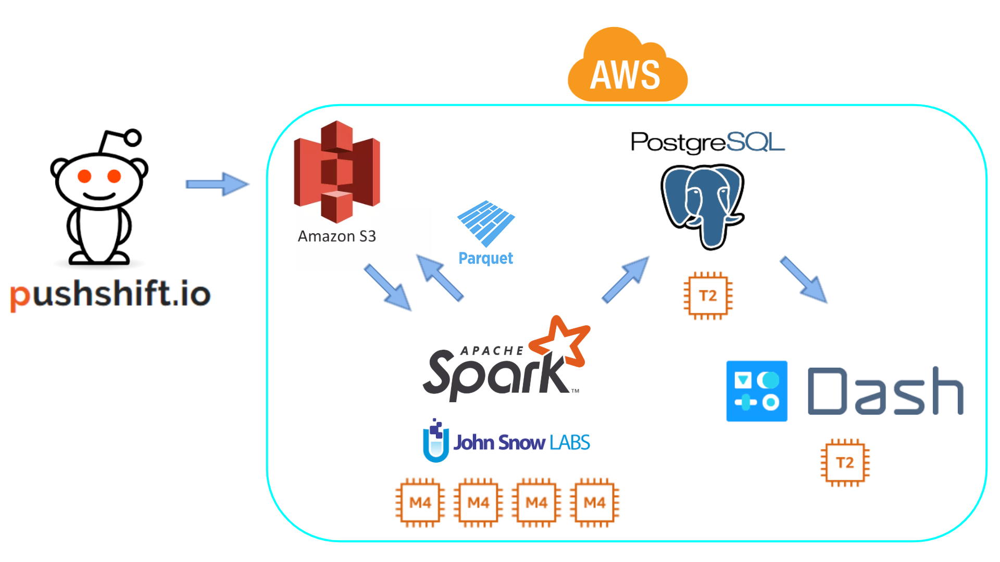

# Reddit Influencer Analytics

## Table of Contents
1. [Problem](README.md#problem)
1. [Product](README.md#product)
1. [Pipeline](README.md#pipeline)
1. [Data source](README.md#data-source)
1. [Website demo](README.md#website-demo)
1. [Repo directory structure](README.md#repo-directory-structure)

## Problem

Reddit is one of the biggest social media platforms with a wide range of topics such as technology, fashion, politics. With 430M monthly active users, Reddit has the potential to influence the image of a company in the eyes of the public. However, actively promoting for a brand or product on the platform is generally not received well within the community. I would like to identify the core members within each community and provide a way for company to grow its influence from the inside.

## Product

For each brand and product, I want to identify the 10 most influential Reddit users based on the score of comments mentioning the brand and product. I believe the result would be useful for marketers (especially in small companies) as they can try to include these users into their marketing campaign. MVP is the list of top 10 users with the highest aggregated score for each product and a graph showing the distribution of score for the product during the chosen month.

## Pipeline

## Data source

Historical [Reddit comments](https://files.pushshift.io/reddit/comments/) data from Dec 2005 to Sep 2019 (600GB compressed, 4.5TB uncompressed)

## Website demo

The website demo is available [here](http://insightful-analytics.me/)

## Repo directory structure

The directory structure for the repo looks like this:

    ├── README.md
    ├── frontend
    │   └── frontend.py
    ├── ingestion
    │   └── ingest.sh
    ├── postgres
    │   └── brand_product.csv
    └── spark
        ├── built.sbt
        ├── src
        │   └── main
        │       └── scala
        │           └── etl.scala
        └── target
            └── scala-2.11
                ├── etl_2.11-1.0.jar
                └── postgresql-42.2.9.jar
        